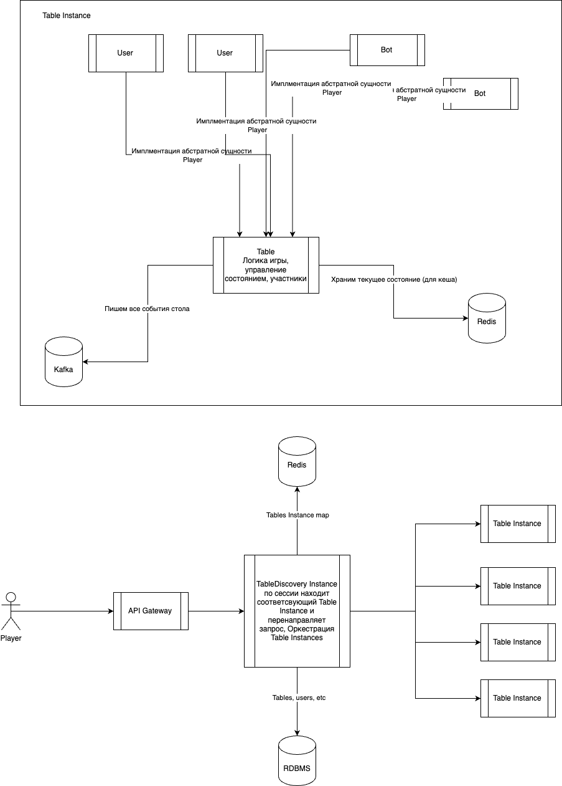

# 📈 Probability Estimator

Оценка вероятности того, что цена актива попадёт в указанный диапазон к заданной дате, используя ожидаемую цену (фьючерс), волатильность и допущение логнормального распределения.

---

## Описание задачи

На входе:
- Тикер (например, `BTC`)
- Целевая дата (например, `2025-07-01`)
- Целевая цена

На выходе:
- Вероятность, что цена окажется в диапазоне плюс/минус 1%

---

## Установка и запуск

```bash
git clone https://github.com/dpanchenko/probability-estimator.git
cd probability-estimator
npm install
npm start
```

---

## Структура

```bash
.
├── doc/
│   └── diagram.png           # Архитектруная диаграма покер сервиса
├── src/
│   └── index.ts              # Точка входа (npm start)
├── package.json
├── tsconfig.json
└── README.md
```

---

## Архитектурная диаграмма

